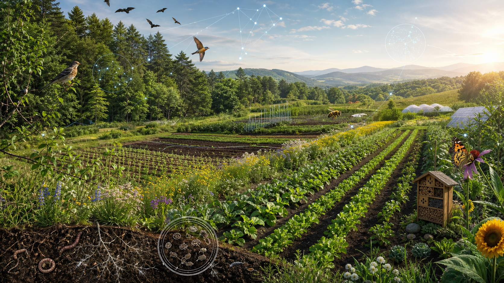
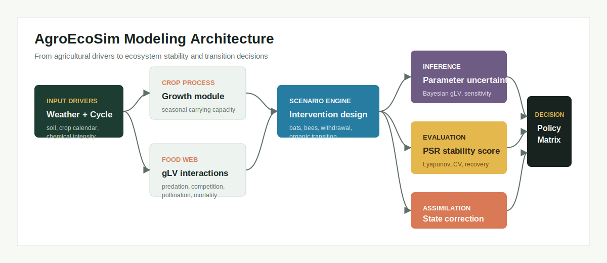
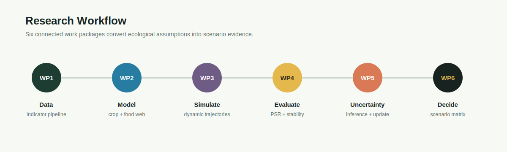
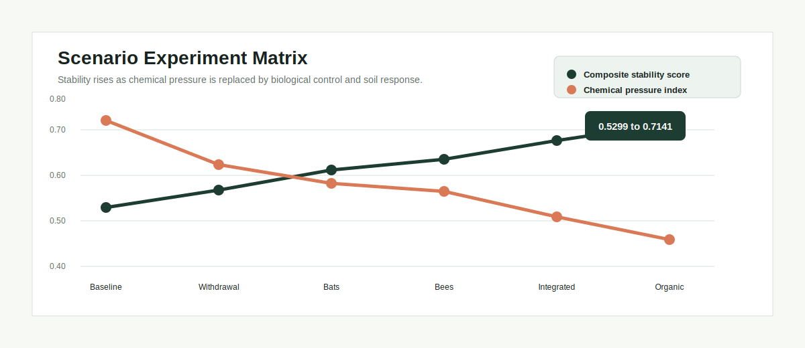
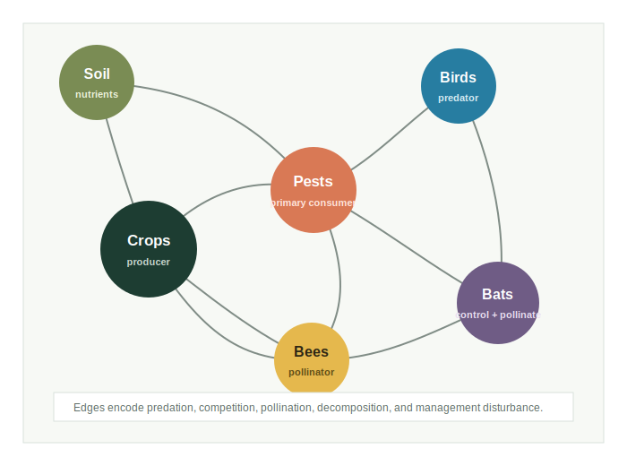
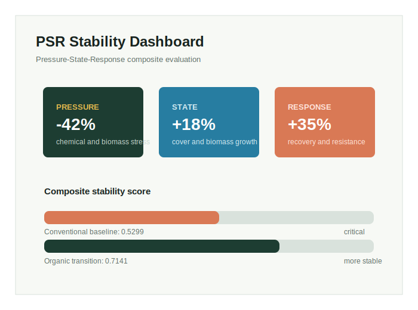

<p align="center">
  
</p>

<h1 align="center">AgroEcoSim</h1>
<p align="center"><strong>Organic Agriculture Ecosystem Modeling & Decision Analysis</strong></p>
<p align="center">
  A research-oriented modeling portfolio for exploring how crop growth, food-web interactions,
  chemical interventions, and organic transition strategies shape agroecosystem stability.
</p>

<p align="center">
  
  
  
  
  
</p>

> **Research question.** How can an agroecosystem reduce chemical dependence while maintaining
> crop productivity, ecological resilience, and long-term economic value?

## Project Overview

AgroEcoSim reframes a 2025 MCM/ICM Problem E solution as a modular research portfolio. The project
connects population dynamics, ecological indicator evaluation, intervention experiments, parameter
uncertainty, and decision analysis into one coherent workflow.

The original study modeled the conversion of forest into farmland and evaluated how agricultural
cycles, pesticides, returning species, bats, bees, and organic practices affect the ecosystem. This
repository presents that work as an expanded modeling system rather than a single competition paper.

| Research layer | Core question | Representative method |
|---|---|---|
| Data and indicators | How do we translate ecological observations into comparable signals? | Cleaning, alignment, normalization, entropy weighting |
| Dynamic system | How do species and crops change over time? | Lotka-Volterra, generalized LV, numerical integration |
| Stability evaluation | Is the ecosystem resilient to management interventions? | PSR index, Lyapunov exponent, CV, recovery time |
| Parameter inference | Which interactions are supported and how uncertain are they? | Regularized and Bayesian gLV inference |
| State updating | How can observations correct the simulation trajectory? | Ensemble data assimilation |
| Decision analysis | Which transition pathway balances ecology and productivity? | Scenario comparison and multi-objective analysis |

## Why This Project

Agricultural management is not a single-variable optimization problem. Removing pesticides may
improve biodiversity while reducing short-term yield; introducing predators can suppress pests but
also reshape the food web; organic transition can improve long-term stability while increasing
initial costs.

AgroEcoSim addresses this tension through a system-level workflow:

- represent the agroecosystem as interacting biological and management components;
- simulate seasonal and intervention-driven population dynamics;
- quantify stability with both dynamic and multi-indicator metrics;
- compare alternative management scenarios using common evaluation criteria;
- expose parameter sensitivity and uncertainty instead of reporting one deterministic trajectory.

## Modeling Framework

<p align="center">
  
</p>

The platform combines an interpretable process model with an evaluation and decision layer:

1. **Crop process layer** converts weather, agricultural cycles, and management inputs into crop
   growth drivers.
2. **Food-web layer** describes competition, predation, pollination, mortality, and chemical
   disturbance through an interaction matrix.
3. **Stability layer** measures system pressure, state, response, resistance, and recovery.
4. **Inference layer** estimates interaction strengths and reports uncertainty.
5. **Decision layer** compares transition pathways across ecological and economic objectives.

## Research Workflow

<p align="center">
  
</p>

| Work package | Output |
|---|---|
| WP1. Indicator pipeline | Harmonized time series and PSR-ready indicators |
| WP2. Coupled crop-food-web model | Seasonal dynamic system with configurable interventions |
| WP3. Multi-species simulation | Species trajectories, phase portraits, and attractor analysis |
| WP4. Stability assessment | Composite PSR score, Lyapunov index, CV, recovery time |
| WP5. Uncertainty and assimilation | Parameter intervals and observation-updated states |
| WP6. Scenario decision analysis | Comparable transition pathways and recommendation matrix |

## Key Modules

| Module | Responsibility | Main interface |
|---|---|---|
| `data.pipeline` | Clean, align, normalize, and construct ecological indicators | `build_indicator_frame()` |
| `models.foodweb` | Define and simulate generalized Lotka-Volterra dynamics | `GLVFoodWeb.simulate()` |
| `models.psr` | Compute entropy weights and composite stability scores | `PSREvaluator.score()` |
| `models.scenarios` | Apply management interventions and compare trajectories | `ScenarioRunner.run()` |
| `inference.bayesian_glv` | Prepare interaction inference and uncertainty summaries | `BayesianGLV.fit()` |
| `assimilation.ensemble` | Update simulated states with observations | `EnsembleAssimilator.update()` |
| `metrics.stability` | Calculate stability, resilience, and recovery metrics | `stability_report()` |
| `visualization.figures` | Produce publication-style result figures | `plot_scenario_comparison()` |

## Scenario Experiments

Six scenarios are expressed through a common configuration schema:

| Scenario | Management design | Research purpose |
|---|---|---|
| Conventional baseline | Seasonal herbicide and pesticide use | Reference productivity and pressure |
| Chemical withdrawal | Remove chemical mortality terms | Observe yield-stability trade-off |
| Bat-assisted control | Add predator and pollination effects | Evaluate biological pest control |
| Bee-assisted pollination | Add pollination with limited predation | Separate pollination contribution |
| Integrated biocontrol | Combine reduced chemicals, bats, and bees | Test mixed intervention strategy |
| Organic transition | Phase out chemicals and improve soil response | Evaluate long-term transition pathway |

```yaml
organic_transition:
  chemical_intensity: 0.10
  biological_control:
    bats: true
    bees: true
  soil_regeneration_rate: 0.035
  evaluation_horizon_years: 10
```

## Results Gallery

<p align="center">
  
</p>

<p align="center">
  
  
</p>

Selected findings from the study narrative:

- The modeled organic transition increased the composite ecosystem stability score from **0.5299**
  to **0.7141**.
- Bat and bee introduction both improved modeled system stability; bats produced the strongest
  anti-interference response in the compared scenarios.
- Chemical withdrawal reduced population fluctuation and recovery time, while exposing a
  short-term crop-yield trade-off.
- Growth-rate parameters for plants and insects were identified as key drivers of population
  dynamics in sensitivity analysis.

## Technical Highlights

- Built a multi-species nonlinear dynamic model linking crops, pests, predators, pollinators, and
  agricultural interventions.
- Translated ecological sustainability into an eight-indicator Pressure-State-Response evaluation
  system with objective entropy weighting.
- Designed comparable intervention experiments and quantified stability through multiple metrics
  instead of relying on qualitative interpretation.
- Extended the research framing toward generalized food-web interactions, Bayesian parameter
  uncertainty, data assimilation, and modular scenario analysis.
- Organized the project as a research software portfolio with explicit interfaces, configurations,
  result artifacts, and visual documentation.

## Repository Structure

```text
AgroEcoSim/
|-- assets/                  # README visuals and diagrams
|-- configs/                 # Scenario and model configuration
|-- docs/                    # GitHub Pages research portfolio
|-- notebooks/               # Research workflow notebooks
|-- results/
|   |-- figures/             # Figure catalog
|   `-- tables/              # Scenario and stability summaries
|-- src/agroecosim/
|   |-- data/                # Indicator processing
|   |-- models/              # gLV, PSR, and scenario modules
|   |-- inference/           # Parameter uncertainty
|   |-- assimilation/        # Observation-state updates
|   |-- metrics/             # Stability metrics
|   `-- visualization/       # Result figures
|-- workflows/               # Research pipeline orchestration
`-- README.md
```

## Research Extensions

The extended design draws methodological inspiration from:

- [MAgPIE](https://github.com/magpiemodel/magpie): modular land-system and scenario framing;
- [BioCro](https://github.com/biocro/biocro): process-oriented crop growth modules;
- [FoodWeb_gLV](https://github.com/PolarTerrestrialEnvironmentalSystems/FoodWeb_gLV): multi-species
  gLV simulation and network benchmarking;
- [Bayesian inference for GLV](https://github.com/LiaoLabATDartmouth/Bayesian_inference_for_GLV):
  posterior uncertainty for ecological interactions;
- [Data assimilation in tomato models](https://github.com/mnqoliveira/data-assimilation-tomato-models):
  calibration, assimilation, evaluation, and visualization workflow.

## Background & Award

This project originated from **2025 MCM/ICM Problem E** and received a **Meritorious Winner (M Award)**
designation. The competition work provided the initial LV-PSR model, scenario experiments, numerical
analysis, sensitivity study, and research communication foundation.

> This repository is a research portfolio reconstruction. It emphasizes system design, analytical
> depth, and project communication rather than claiming a fully reproducible scientific package.

## GitHub Pages

The portfolio site is contained in `docs/`. After uploading the repository, enable it through
**Settings > Pages > Deploy from a branch > main / docs**.
